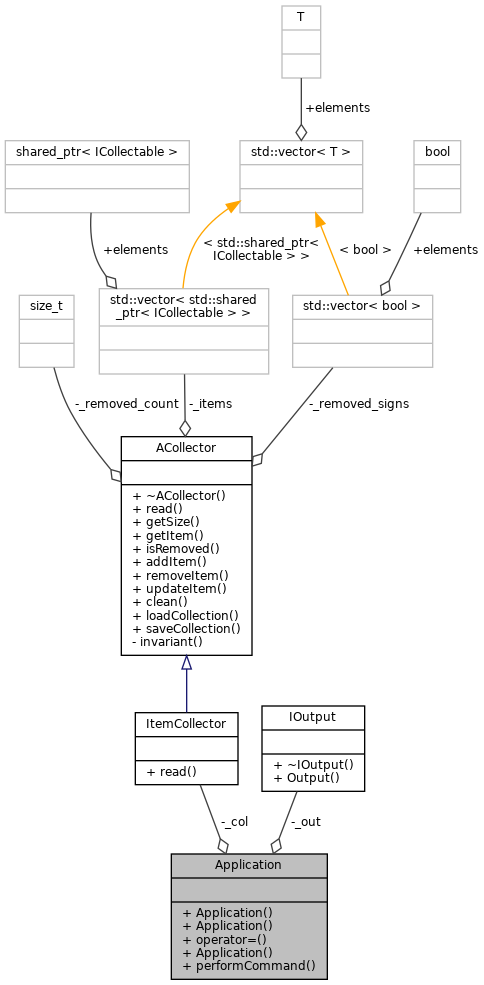
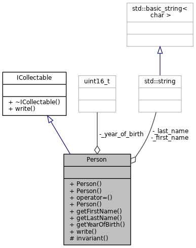
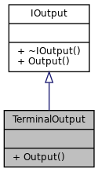

Министерство науки и высшего образования Российской Федерации  
Федеральное государственное бюджетное образовательное учреждение  
высшего образования  
«Московский государственный технический университет  
имени Н.Э. Баумана  
(национальный исследовательский университет)»  
(МГТУ им. Н.Э. Баумана)

---

Кафедра ИУ6  
"Компьютерные системы и сети"

---
Курс: "Современные средства разработки ПО" 

Автор: студент группы ИУ6-ХХ Иванов Иван Иванович

Лабораторная работа №3. Описание модели, изоляция предметной области

Предметная область (задача): "Мои друзья"

**Цель работы**: Приобрести навыки описания модели предметной области, выполнения ее изоляции.

**Объем работы**: 4 часа.

Студенты должны составить словарь заданной предметной области, отобразить модель предметной области в виде UML-диаграммы, выделить уровни реализации модели с учетом принципа изоляции предметной области.

# Отчет

## Диаграмма классов

## Диаграмма последовательности

Последовательность выполнения команды load:

## Выводы

# Документация

Документация создаётся автоматически при обновлении ветки `master` и выкладывается в страницы проекта на GitLab: [http://lsx.pages.bmstu.codes/msdt-study-group/labs/l3/](http://lsx.pages.bmstu.codes/msdt-study-group/labs/l3/).

